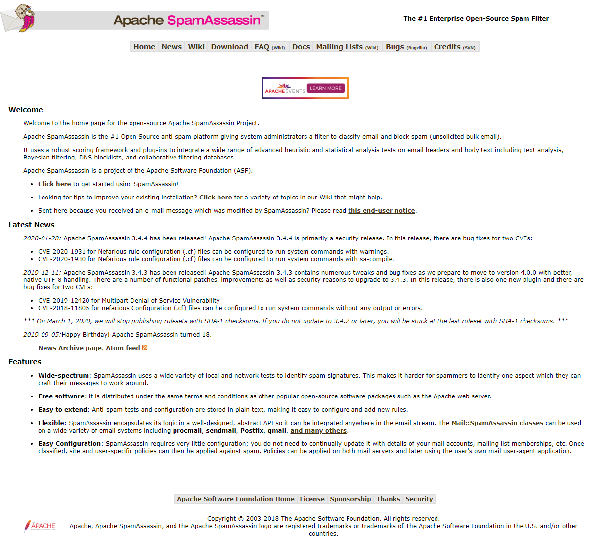

```{R setup, include=FALSE}
knitr::opts_chunk$set(echo = FALSE)
library(knitr)
library(kableExtra)
library(pastecs)
library(rpart)
library(ggplot2)
library(itertools)
library(tidyr)
library(dplyr)
```

## Project Guidelines

Using the “emailDFrp” dataset:

1.	Build and evaluate a tree-based model for predicting “spam”
2.	Plot and analyze the paths through one (or many) of your trees
3.	Explain the parameters involved in “tuning” your model
4.	Which variables were “most” important?
5.	How did you evaluate the “performance” of your model?

NOTE: You should use “split” your data when training your model.

## Objective
Most spam messages can usually be identified in a person's email list through the subject line and sender, but may occassionally require a glimpse of the message contents to provide a more conclusive approach. Spam filters examine these various characteristics of an email before classifying the message and placing it into the inbox of spam folder. 

In this study, a classification tree-based model will be built to predict whether an email message is spam (unwanted) or not spam (wanted) through recursive partitioning.
<br>
<br>

## Data Description
The model will be built using data from the open-source [Apache SpamAssassin Project](https://spamassassin.apache.org/) that contains over 9000 labeled email messages for the purposes of developing spam filters. The original data from the SpamAssassin corpus is in text format and must be processed to quantify the information into a useful format. 


<figure class ="image">
<center>
    
    <figcaption id = "Figure 1"> **Figure 1: Apache SpamAssassin Home Page** </figcaption>
</center>
</figure>
<br>
<br>

An email can be separated into the header and the body. The header contains information regarding the date sent, the sender, the subject, the message ID, carbon copy recipients, and additional routing information. This can be understood as the encasing envelope for the message. The body can understood as the actual letter that contains the intended message for the recipient and may contain additional information beyond text such as file attachments.

A number of text mining and statistical analysis approaches can be taken to derive meaningful features from email messages. Such features are the character count within the body content of the email, the number of accompanying file attachments, and wheter "Re:" appears at the start of the subject to denote a reply. In this study, a pre-processed format of the data was provided so the specific details regarding the data processing steps will not be explained further.

```{R load email data}
# Load Data (data.Rda file needs to be in same directory as markdown)
emilDFrp = load("data.Rda")
# Cast data as data frame
emails = data.frame(emailDFrp)

# Display first and last 10 processed emails from data frame
kable(head(emails, n=10), caption = "Table 1: First 10 Process Emails") %>%
  kable_styling(bootstrap_options = c("striped","hover","responsive")) %>%
  scroll_box(width = "100%", height = "465px")
kable(tail(emails, n=10), caption = "Table 2: Last 10 Processed Emails") %>%
  kable_styling(bootstrap_options = c("striped","hover","responsive")) %>%
  scroll_box(width = "100%", height = "470px")

# Display Internal Structure of Data Frame
str(emails)
```
<br>

The first and last 10 messages from the processed emails data are provided above respectively in Table 1 and 2. The first 10 messages are a sample of 10 emails that are labled as not spam and the last 10 messages are a sample of 10 emails that are labeled as spam. The structure of the processed emails dataframe containing a total of 9,348 messages and 30 feature variables is also displayed above. The first 17 features are categorical variables with 2 levels each denoting a boolean value of whether or not the message contains that certain feature. The first feature (isSpam) is the target variable labeling whether or not the email was identified as spam. The last 13 features are numerical variables describing various attributes of the message such as length and number of punctuations present. A full, detailed explanation of each feature in the processed emails dataframe is provided below in Table 3. 

<br>

|   Variable      |      Type    |                                      Definition                                          |
|:--------------- |:------------:|-----------------------------------------------------------------------------------------:|
|isSpam           |logical       |TRUE if email message is spam (target variable).                                          |
|isRe             |logical       |TRUE if "Re:" appears at the start of the subject.                                        |
|numLines         |integer       |Number of lines in the body of the message.                                               | 
|bodyCharCt       |integer       |Number of characters in the body of the message.                                          |
|underscore       |logical       |TRUE if email address in the FROM field of the header contains an underscore.             |
|subExcCt         |integer       |Number of exclamation marks in the subject.                                               |
|subQuesCt        |integer       |Number of question marks in the subject.                                                  |
|numAtt           |integer       |Number of attachments in the message.                                                     |
|priority         |logical       |TRUE if a Priority key is present in the header.                                          |
|numRec           |numeric       |Number of recipients of the message, including CCs.                                       |
|perCaps          |numeric       |Percentage of capitals among all letters in the message body, excluding attachments.      |
|isInReplyTo      |logical       |TRUE if the In-Reply-To key is present in the header.                                     |
|sortedRec        |logical       |TRUE if the recipients' email addresses are sorted.                                       |
|subPunc          |logical       |TRUE if words in the subject have punctuation or numbers embedded in them. (e.g. w!se)    |
|hour             |numeric       |Hour of the day in the Date field.                                                        |
|multipartText    |logical       |TRUE if the MIME type is multipart/text.                                                  |
|hasImages        |logical       |TRUE if the message contains images.                                                      |
|isPGPsigned      |logical       |TRUE if the message contains a PGP signature.                                             |
|perHtML          |numeric       |Percentage of characters in HTML tags in the message body in comparison to all characters.|
|subSpamWords     |logical       |TRUE if the subject contains one of the words in a spam word vector.                      |
|subBlanks        |numeric       |Percentage of blanks in the subject.                                                      |
|noHost           |logical       |TRUE if there is no hostname in the Message-Id key in the header.                         |
|numEnd           |logical       |TRUE if the email sender's address (before the @) ends in a number.                       |
|isYelling        |logical       |TRUE if the subject is all capital letters.                                               |
|forwards         |numeric       |Number of forward symbols in a line of the body. (e.g. >>> xxx contains 3 forwards)       |
|isOrigMsg        |logical       |TRUE if the message body contains the phrase original message.                            |
|isDear           |logical       |TRUE if the message body contains the word "dear".                                        |
|isWrote          |logical       |TRUE if the message contains the phrase "wrote:".                                         |
|avgWordLen       |numeric       |The average length of the words in  a message.                                            |
|numDlr           |numeric       |Number of dollar signs in the message body.                                               |

Table: Table 3: Variable Definition Table
<br>

### Summary Statistics 

```{R Summary Statistics}
# Display Summary Statistics of Numerical Data Columns
kable(stat.desc(emails[,18:30]), caption = "Table 4: Summary Statistics of Numerical Variables") %>%
  kable_styling(bootstrap_options = c("striped","responsive")) %>%
  scroll_box(width = "100%", height = "607px")
# Display Summary Statistics of Boolean Data Columns
kable(summary(emails[,1:17]), caption = "Table 5: Summary Statistics of Categorical Variables") %>%
  kable_styling(bootstrap_options = c("striped","responsive")) %>%
  scroll_box(width = "100%", height = "220px")
```
<br>
<br>

```{R Categorical Variables Visualization, fig.align = "center", fig.width = 16, fig.height = 8}
# Initialize an empty dataframe
TFcounts = data.frame(FeatureVariables = character(), TFcounts = integer())
for (col in as.list(enumerate(colnames(emails[,1:17])))){
  #print(col$index)
  #print(col$value)
  TFcounts = rbind(TFcounts, data.frame(FeatureVariables = col$value, TFcounts = table(emails[,col$index])))
}

ggplot(data = TFcounts, aes(x = FeatureVariables, y = TFcounts.Freq, fill = TFcounts.Var1, label = scales::percent(prop.table(TFcounts.Freq)))) +
  geom_bar(position="fill", stat = "identity") +
  scale_y_continuous(labels = scales::percent) +
  theme(legend.position = "top")
```


``` {R Numerical Variables Visualization, fig.align = "center", fig.width = 12, fig.height = 6}
emails[,c(18:30)] %>% 
  pivot_longer(., cols = colnames(emails[,c(18:30)]), names_to = "FeatureVariables", values_to = "Val") %>%
  ggplot(aes(x = FeatureVariables, y = Val)) +
  geom_boxplot()
```

```{R Visualize Missing Values, fig.align = "center"}
# Initialize an empty data frame
missCols = data.frame(FeatureVariables = character(), MissingValues = integer())
for (col in as.list(enumerate(colnames(emails)))){
  missVals = sum(is.na(emails[,col$index]))
  if (missVals > 0) {
    #rbind(missCols, as.list(c(col$value,missVals)))
    missCols = rbind(missCols, data.frame(FeatureVariables = col$value, MissingValues = missVals))
  }
}

ggplot(data = missCols, aes(x=FeatureVariables, y=MissingValues, fill=factor(ifelse(MissingValues>20,"yes","no")))) + 
  geom_bar(stat = "identity") + 
  scale_fill_manual(values = c("yes"="red","no"="grey"), guide = FALSE) +
  labs(title = "Number of Missing Values per Feature Variable", x = "Feature Variable", y = "Missing Values", caption = "Figure 2: Plot of Missing Values per Feature Variable") + 
  theme(plot.title = element_text(hjust = 0.5), plot.caption = element_text(hjust = 0.5))
```
